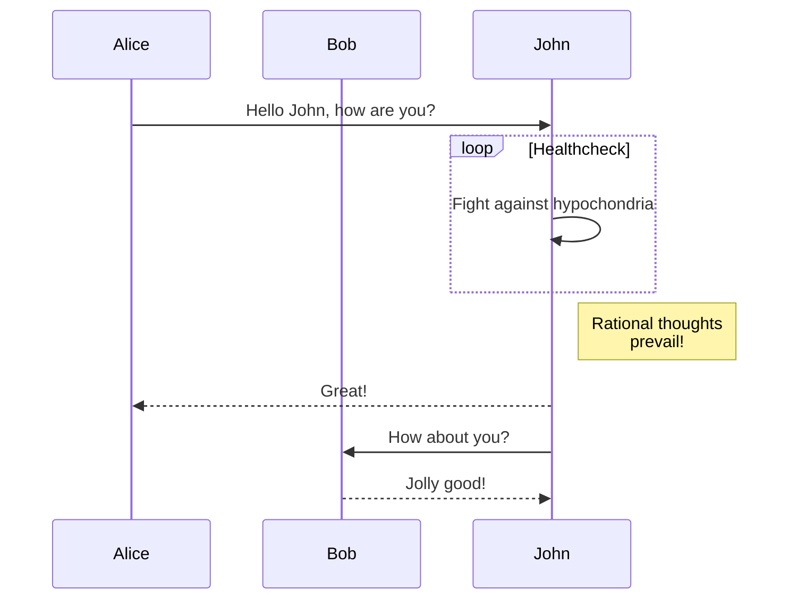
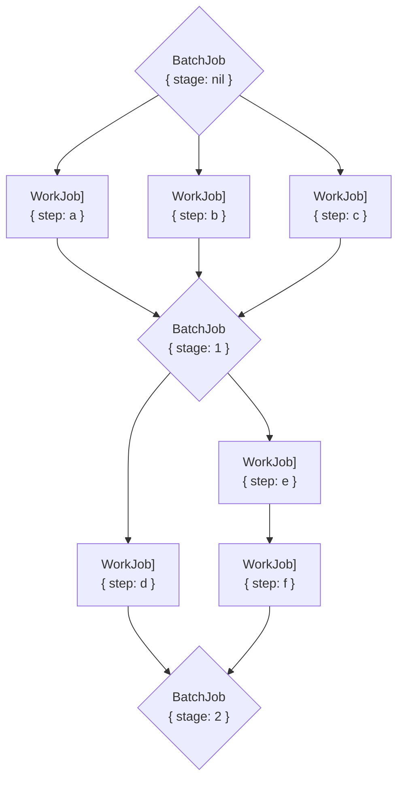

> [!important] Docker Support
>
> If you have the Docker CLI installed already, you can avoid installing `hugo-obsidian` and `hugo`. Instead, open your terminal, navigate to your folder with Quartz and run `make docker`

> [!summary] Docker Support
>
> If you have the Docker CLI installed already, you can avoid installing `hugo-obsidian` and `hugo`. Instead, open your terminal, navigate to your folder with Quartz and run `make docker`

> [!done] Docker Support
>
> If you have the Docker CLI installed already, you can avoid installing `hugo-obsidian` and `hugo`. Instead, open your terminal, navigate to your folder with Quartz and run `make docker

![[tils/images/obsidian-settings.png]]




## Hello


```goat
   _________________
  ╱                 ╲                                                     ┌─────┐
 ╱ DO YOU UNDERSTAND ╲____________________________________________________│GOOD!│
 ╲ FLOW CHARTS?      ╱yes                                                 └──┬──┘
  ╲_________________╱                                                        │
           │no                                                               │
  _________▽_________                    ______________________              │
 ╱                   ╲                  ╱                      ╲    ┌────┐   │
╱ OKAY, YOU SEE THE   ╲________________╱ ... AND YOU CAN SEE    ╲___│GOOD│   │
╲ LINE LABELED 'YES'? ╱yes             ╲ THE ONES LABELED 'NO'? ╱yes└──┬─┘   │
 ╲___________________╱                  ╲______________________╱       │     │
           │no                                     │no                 │     │
   ________▽_________                     _________▽__________         │     │
  ╱                  ╲    ┌───────────┐  ╱                    ╲        │     │
 ╱ BUT YOU SEE THE    ╲___│WAIT, WHAT?│ ╱ BUT YOU JUST         ╲___    │     │
 ╲ ONES LABELED 'NO'? ╱yes└───────────┘ ╲ FOLLOWED THEM TWICE? ╱yes│   │     │
  ╲__________________╱                   ╲____________________╱    │   │     │
           │no                                     │no             │   │     │
       ┌───▽───┐                                   │               │   │     │
       │LISTEN.│                                   └───┬───────────┘   │     │
       └───┬───┘                                ┌──────▽─────┐         │     │
     ┌─────▽────┐                               │(THAT WASN'T│         │     │
     │I HATE YOU│                               │A QUESTION) │         │     │
     └──────────┘                               └──────┬─────┘         │     │
                                                  ┌────▽───┐           │     │
                                                  │SCREW IT│           │     │
                                                  └────┬───┘           │     │
                                                       └─────┬─────────┴─────┘
                                                     ┌───────▽──────┐
                                                     │LET'S GO DRING│
                                                     └───────┬──────┘
                                                   ┌─────────▽─────────┐
                                                   │HEY, I SHOULD TRY  │
                                                   │INSTALLING FREEBSD!│
                                                   └───────────────────┘

```
